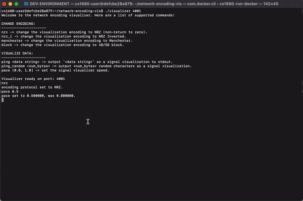
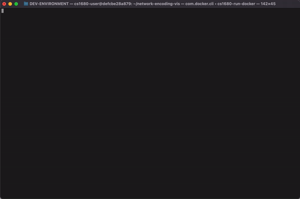
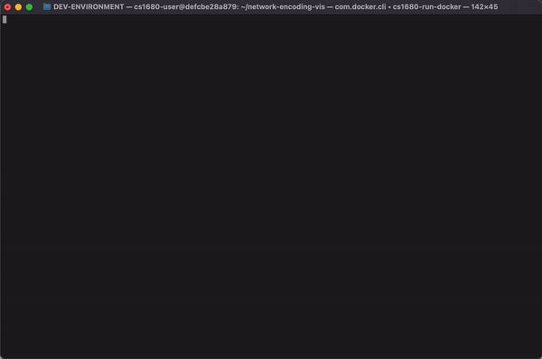
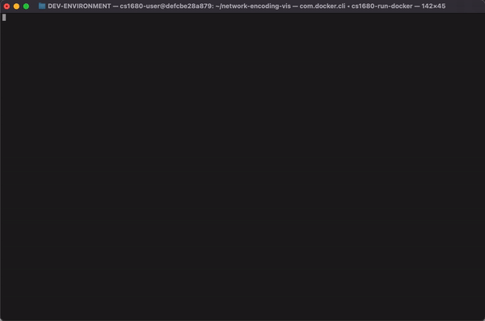

# Network Encoding on the Physical Layer -- Visualizer

Visualizing how bits are transformed into signals on the physical layer. NRZ, Manchester, block encoding.

## How to use

Usage: `./visualizer <udp_port_num>`

### Supported commands:

**Changing encoding method:**
- `nrz` -> change the visualization mode to NRZ (non-return to zero)
- `nrz_i` -> change the visualization mode to NRZ (no-return to zero) inverted
- `manchester` -> change the visualization mode to Manchester
- `block` -> change the visualization mode to 4B/5B block encoding

Default mode is `nrz`. Default `pace` is `0.8`. More data on encoding techniques below.

**Running the visualizer:**
- `ping <data string>` -> send a packet containing `<data string>` to the listener, outputting the visualization to `stdout`.
- `ping_random <num_bytes>` -> send `<num_bytes>` random bytes as a packet to the listener, outputting the visualization to `stdout`.
- `ping_file <filepath>` -> read from the specified filepath and split up the file into packets to send to the visualizer.

**Visualizer settings:**
- `pace (0.0, 1.0]` -> set the signal visualizer speed

## Encoding techniques

**NRZ**

Displays 1 as high voltage, 0 as low voltage.

**NRZ Inverted**

0 stays at the same voltage, 1 transitions to the opposite voltage.

**Manchester**

0 is a low to high voltage transition, 1 is a high to low voltage transition.

**4B/5B Block Encoding**

Same as NRZ Inverted, but each segment of 4 bits is converted into 5 bits according to the conversion table so as to break up continuous 0's.

## Extra:
- scale by terminal environment width
